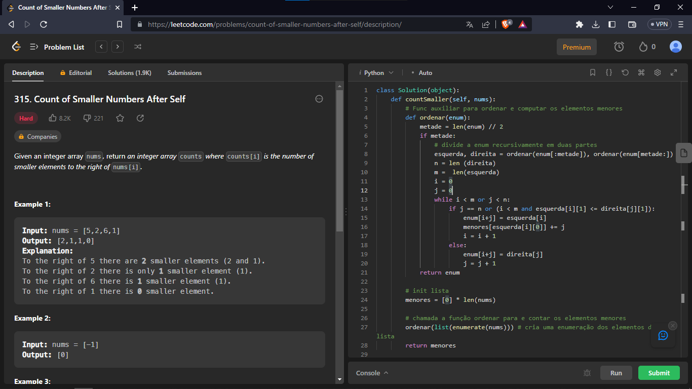
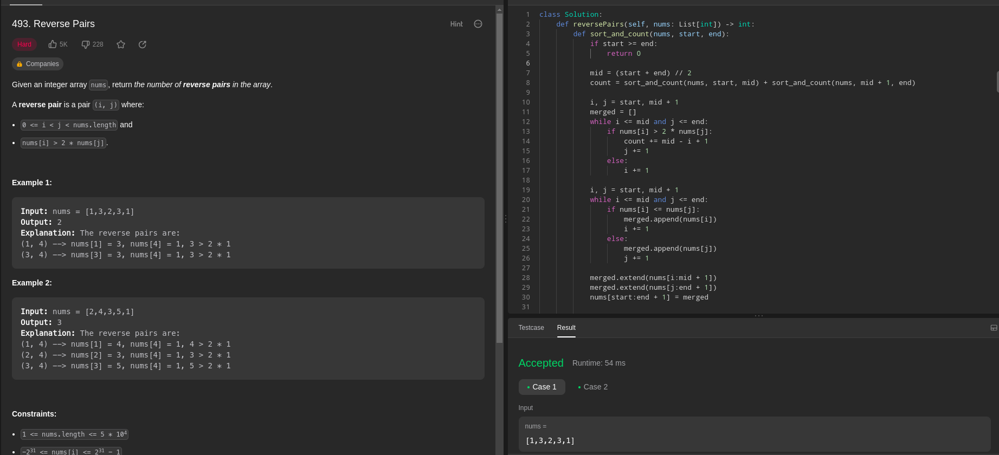

# D&C_Exercicios_Dupla39

**Número da Lista**: 4 
**Conteúdo da Disciplina**: Dividir e Conquistar  

## Alunos
|Matrícula | Aluno |
| -- | -- |
| 17/0154319  |  Philipe de Sousa Barros |
| 20/0042416  |  Pablo Christianno Silva Guedes |

## Sobre 
Este trabalho envolve a resolução de exercícios que abordam o conteúdo do módulo de Algoritmos de Dividir e Conquistar da disciplina de Projeto de Algoritmos. O foco principal é a aplicação de algoritmos em problemas relacionados a toda a classe de problemas que possam ser resolvidos utilizando algoritmos de dividir e conquistar.

## Screenshots
### Exercicio 1 - "Count of Smaller Numbers After Self "
**Nível do exercício: Difícil** 

Para acessar a página do exercício [clique aqui](https://leetcode.com/problems/count-of-smaller-numbers-after-self/description/)

**Linguagem**: Python 
**Framework**:  
### Vídeo do Exercício 1 [clique aqui](https://www.youtube.com/watch?v=LHVDWGMk0LY&t=5s)

## Screenshots
### Exercicio 1 - "Reverse Pairs "
**Nível do exercício: Difícil** 

Para acessar a página do exercício [clique aqui](https://leetcode.com/problems/reverse-pairs/description/)

**Linguagem**: Python 
**Framework**:  
### Vídeo do Exercício 1 [clique aqui](https://youtu.be/zPw4zxG_7vI)

## Outros 
Quaisquer outras informações sobre seu projeto podem ser descritas abaixo.
